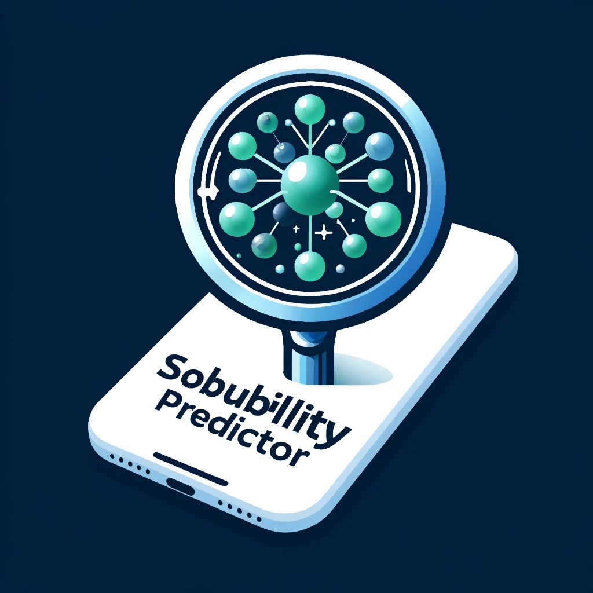

# "Solubility Predictor" Application

## Project Overview

The "Solubility Predictor" app is designed to assist scientists and researchers in predicting the solubility of various molecules. This tool leverages advanced computational algorithms to quickly and accurately predict solubility data, and can possibly serve as a useful tool in chemical and pharmaceutical research.

